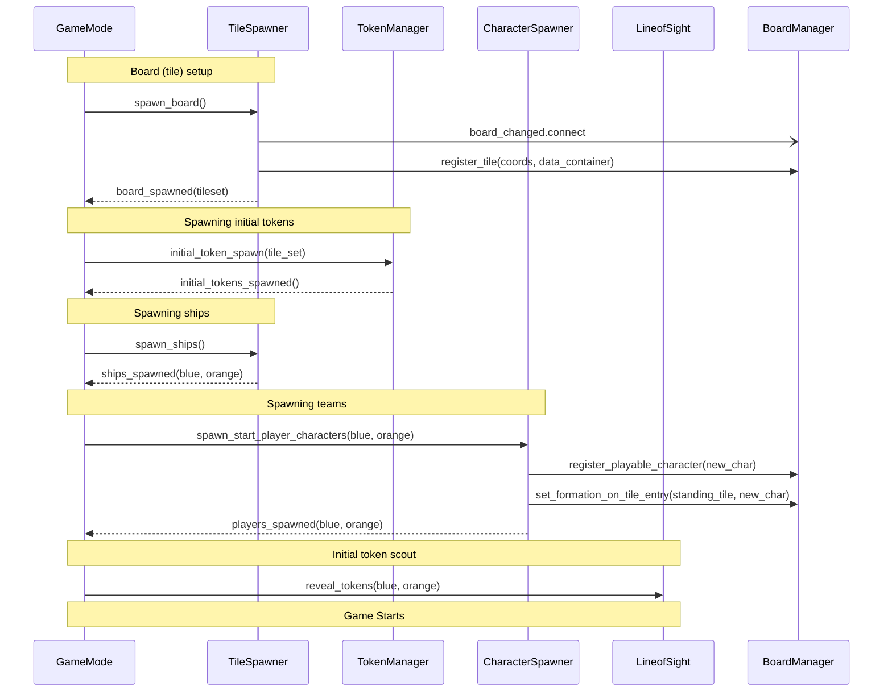

```mermaid
	sequenceDiagram
		participant GM as GameMode
		participant TS as TileSpawner
		participant TM as TokenManager
		participant CS as CharacterSpawner
		participant LOS as LineofSight
		participant BM as BoardManager
		
	Note over GM, TS: Board (tile) setup	
	GM->>TS: spawn_board()
	TS-)BM: board_changed.connect
	TS->>BM: register_tile(coords, data_container)
	TS-->>GM: board_spawned(tileset)
	
	Note over GM, TM: Spawning initial tokens
	GM->>TM: initial_token_spawn(tile_set)
	TM-->>GM: initial_tokens_spawned()
	
	Note over GM, TS: Spawning ships
	GM->>TS: spawn_ships()
	TS-->>GM: ships_spawned(blue, orange)
	
	Note over GM, CS: Spawning teams
	GM->>CS: spawn_start_player_characters(blue, orange)
	CS->>BM: register_playable_character(new_char)
	CS->>BM: set_formation_on_tile_entry(standing_tile, new_char)
	CS-->>GM: players_spawned(blue, orange)
	
	Note over GM, LOS: Initial token scout
	GM->>LOS: reveal_tokens(blue, orange)
	
	Note over GM, LOS: Game Starts
	 
	
```